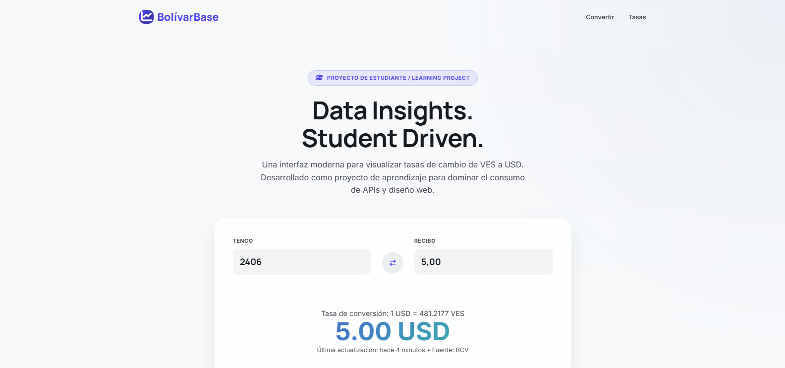

# 🚀 BolívarBase



**BolívarBase** es una aplicación web moderna diseñada para la consulta y conversión de divisas en tiempo real, enfocada principalmente en el mercado venezolano (VES/USD).

---

## 📝 Sobre este Proyecto

Este proyecto es estrictamente para fines de **aprendizaje y práctica personal**. 
Soy un **futuro desarrollador de software** y este sitio es una demostración de mis habilidades técnicas en el desarrollo frontend y el consumo de APIs.

> [!IMPORTANT]
> **Aviso de No Oficialidad:** Este sitio **NO** es una entidad oficial del Banco Central de Venezuela (BCV), ni está afiliado a ningún organismo gubernamental o financiero. Los datos mostrados tienen fines meramente informativos y educativos.

## 🛠️ Tecnologías Utilizadas

- **Frontend:** HTML5, CSS3 (Vanilla), JavaScript (ES6+).
- **Diseño:** Glassmorphism, Responsive Design, Tipografía Premium.
- **API:** Alimentado por la [API BCV de Sua7Dev](https://github.com/Sua7Dev/api-bcv-sua).

## 🌍 Despliegue

Puedes ver el proyecto en vivo aquí:  
[https://web-api-bcv.vercel.app/](https://web-api-bcv.vercel.app/)

## 🚀 Instalación y Uso Local

1. Clona el repositorio:
   ```bash
   git clone https://github.com/Sebitasg14/web-api-bcv.git
   ```
2. Instala las dependencias:
   ```bash
   bun install
   ```
3. Ejecuta el servidor de desarrollo:
   ```bash
   bun run server.js
   ```

---

*Desarrollado con ❤️ por un estudiante de programación.*
